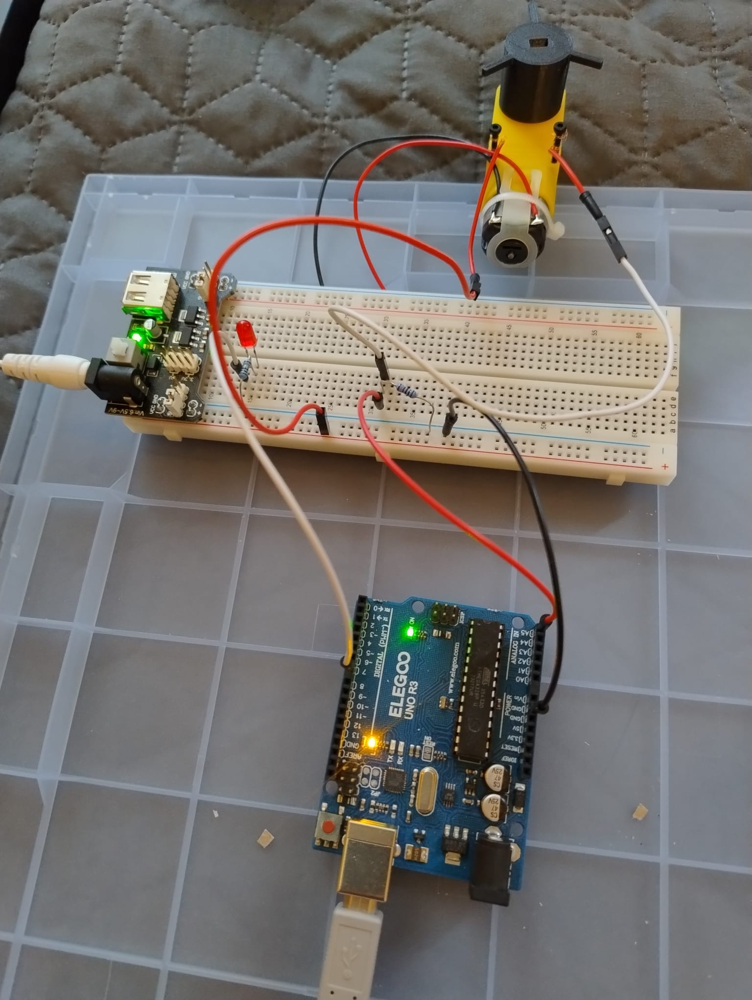

# End switch draft

  

* Stripped a male pin cable and Tied it to a left screw
* Connected left screw to 5v
* Stripped anoter male pin cable and tied it to a right screw
* Connected right screw to breadboard and to analog read at arduino
* Connected a led that would turn on if resistance is read on right screw.

