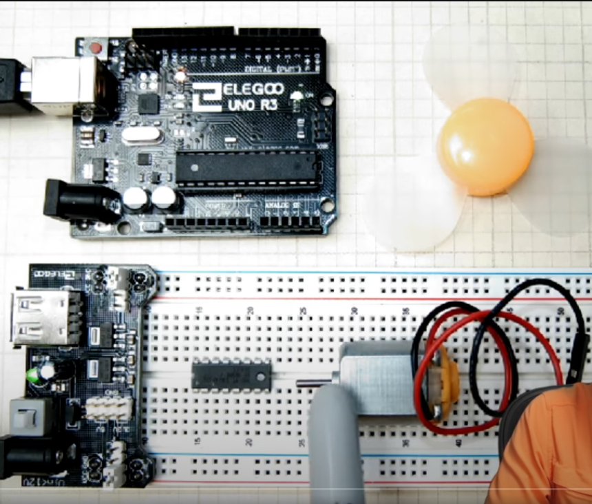
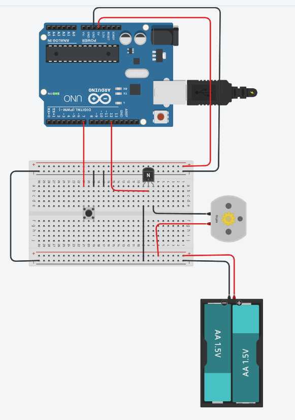
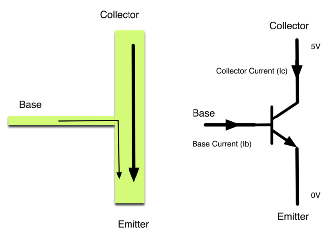

# Notes

Video link https://www.youtube.com/watch?v=fPLEncYrl4Q&list=PLGs0VKk2DiYw-L-RibttcvK-WBZm8WLEP&index=38

Avoid plugging in a dc motor directy to the arduino as it can burn the components.

The motor can try to pull more current from the arduino that it can provide.

There should always be a component before the dc motor.

DC motors can be handled with transistors:
- https://www.youtube.com/watch?v=XrJ_zLWFGFw
- Transistors are used to manage components that require more current than the one that the arduino can output.

Make sure to use a DC controller that can handle the current that the dc motor requires.

Controlling dc motor using NPN transistor:

## Using transistors

Controlling dc motor using MOSFED transistor:
- https://www.youtube.com/watch?v=XrJ_zLWFGFw

Transistors basics: https://learn.adafruit.com/adafruit-arduino-lesson-13-dc-motors/transistors

Tinkercad design: https://www.tinkercad.com/things/3GzYyt19kpS-fantastic-luulia/editel?tenant=circuits

IMPORTANT: always remember to have a common ground!